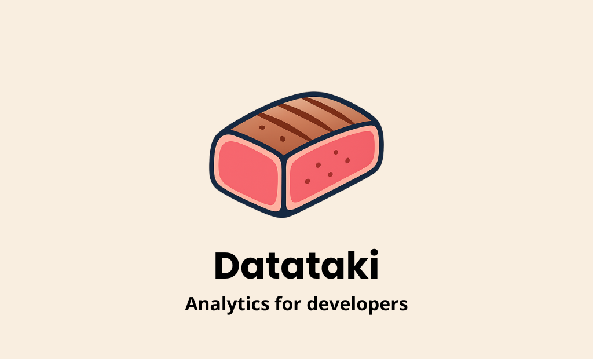

# Datataki Client

[](https://badge.fury.io/js/%40datataki%2Fclient)
[](https://opensource.org/licenses/MIT)

A lightweight, privacy-focused client-side event tracking library for modern web applications. Track user sessions, page views, interactions and custom events with minimal setup and zero dependencies.



## ✨ Features

- 🔄 **Automatic tracking**: Sessions, page views, clicks, and scroll events
- ✨ **Custom events** with validation and rich metadata support
- 📱 **Device & UTM detection** for comprehensive analytics
- 🔒 **Privacy-focused**: No cookies, localStorage only
- 📦 **Performance optimized**: Batching, debouncing, < 15KB
- 🛡️ **TypeScript ready** with full type definitions

## 📦 Installation

```bash
npm install @datataki/client
```

## 🚀 Quick Start

### ES Modules / TypeScript
```typescript
import { Datataki } from '@datataki/client';

// Initialize tracking
Datataki.init({
  apiUrl: 'https://your-api-endpoint.com',
  mode: 'default',
  sessionTimeout: 900000, // 15 minutes
  samplingRate: 1.0,
  globalMetadata: {
    appVersion: '1.0.0',
    environment: 'production'
  }
});

// Send custom event
Datataki.event('user_signup', {
  method: 'email',
  plan: 'premium',
  source: 'landing_page'
});
```

### CommonJS
```javascript
const { Datataki } = require('@datataki/client');
Datataki.init({ apiUrl: 'https://your-api-endpoint.com' });
```

### Browser CDN
```html
<script src="https://unpkg.com/@datataki/client/dist/browser/app.js"></script>
<script>
  Datataki.init({ apiUrl: 'https://your-api-endpoint.com' });
</script>
```

## ⚙️ Configuration

```typescript
Datataki.init({
  apiUrl: string; // Required: API endpoint where events will be sent
  mode?: 'demo' | 'test' | 'default'; // Default: 'default'
  qaMode?: boolean; // Enable debug logging
  samplingRate?: number; // 0-1, default: 1.0
  sessionTimeout?: number; // Default: 900000 (15min)
  excludedUrlPaths?: string[]; // Routes to exclude
  globalMetadata?: Record<string, MetadataType>;
  allowHttp?: boolean; // For development
  sensitiveQueryParams?: string[]; // Remove from URLs
  integrations?: {
    googleAnalytics?: { measurementId: string };
  };
});
```

### Examples

**Basic:**
```typescript
Datataki.init({
  apiUrl: 'https://analytics.yourapi.com/events'
});
```

**Production:**
```typescript
Datataki.init({
  apiUrl: 'https://analytics.yourapi.com/events',
  samplingRate: 0.8,
  excludedUrlPaths: ['/admin/*', '/private/*'],
  globalMetadata: {
    appVersion: '2.1.0',
    environment: 'production'
  }
});
```

### URL Path Exclusion

Exclude routes from scroll/click tracking:

```typescript
excludedUrlPaths: [
  '/admin', // Exact match
  '/admin/*', // Wildcard match  
  '/private/*' // All private routes
]
```

## 📊 Event Tracking

Datataki automatically tracks:
- **Sessions** (`SESSION_START`/`SESSION_END`) with UTM parameters
- **Page views** (`PAGE_VIEW`) including SPA navigation  
- **Clicks** (`CLICK`) with element details and coordinates
- **Scroll events** (`SCROLL`) with depth percentage and direction

### Enhanced Click Tracking

Use `data-tl-name` and `data-tl-value` for custom click events:

```html
<button data-tl-name="signup_cta" data-tl-value="premium">
  Start Free Trial
</button>
```

This sends both a standard click event and a custom event:
```javascript
{ type: 'CUSTOM', name: 'signup_cta', metadata: { value: 'premium' } }
```

## 🎨 Custom Events

Send business events with the `event()` method:

```typescript
// Simple event
Datataki.event('user_signup');

// With metadata
Datataki.event('purchase_completed', {
  productId: 'prod_123',
  price: 99.99,
  categories: ['electronics', 'phones'],
  isFirstPurchase: true
});
```

### Validation Limits
- Event name: 120 characters max
- Metadata: 8KB total, 10 keys max, 10 array items max
- Valid types: `string`, `number`, `boolean`, `string[]`

## � Data & Performance

**Automatic Detection:**
- Device type: `mobile`, `tablet`, `desktop`
- UTM parameters for marketing attribution

**Smart Processing:**
- Events batched every 10 seconds (500 event queue limit)
- Uses `sendBeacon` with `fetch` fallback
- Exponential backoff retry on failures
- < 15KB bundle size, zero dependencies

## 🔒 Privacy & Security

- **No cookies**: localStorage only for user identification
- **HTTPS enforced**: HTTP blocked by default (except development)
- **Data validation**: All inputs sanitized and size-limited
- **Configurable exclusions**: Remove sensitive routes/parameters

## 🔧 Advanced Usage

### TypeScript Support
```typescript
import { Datataki, Config, MetadataType } from '@datataki/client';

const config: Config = {
  apiUrl: 'https://api.example.com/events',
  globalMetadata: {
    version: '1.0.0',
    debugMode: false
  }
};

Datataki.init(config);
Datataki.event('purchase', { productId: 'prod_123', price: 99.99 });
```

### Lifecycle Management
```typescript
// Cleanup when done
Datataki.destroy();
```

### Development Mode
```typescript
Datataki.init({
  apiUrl: 'http://localhost:3000/events',
  mode: 'test',
  qaMode: true,  // Enable debug logging
  allowHttp: true
});
```

## 🤝 Contributing

We welcome contributions! See [CONTRIBUTING.md](CONTRIBUTING.md) for details.

```bash
git clone https://github.com/nacorga/datataki-client.git
npm install
npm run build:all
npm run test:e2e
```

## 📄 License

MIT License - see [LICENSE](LICENSE) file for details.

## 🔗 Links

- **GitHub**: [nacorga/datataki](https://github.com/nacorga/datataki-client)
- **npm**: [@datataki/client](https://www.npmjs.com/package/@datataki/client)
- **Issues**: [Bug reports & features](https://github.com/nacorga/datataki-client/issues)
